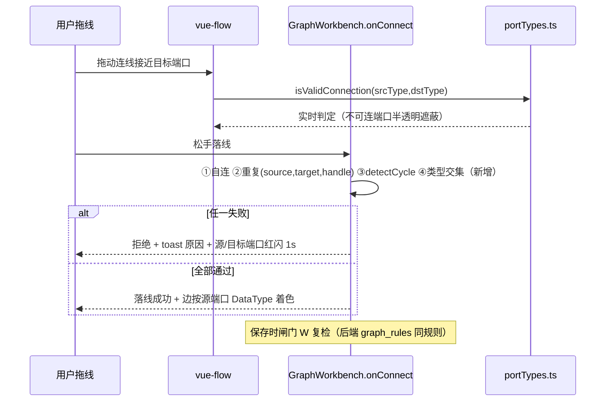
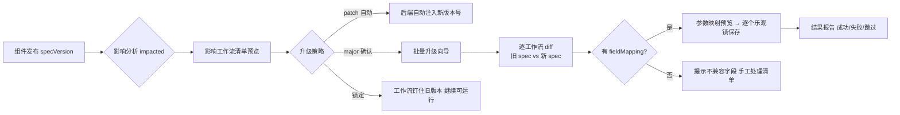
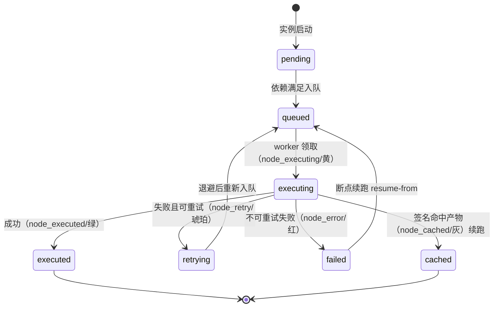
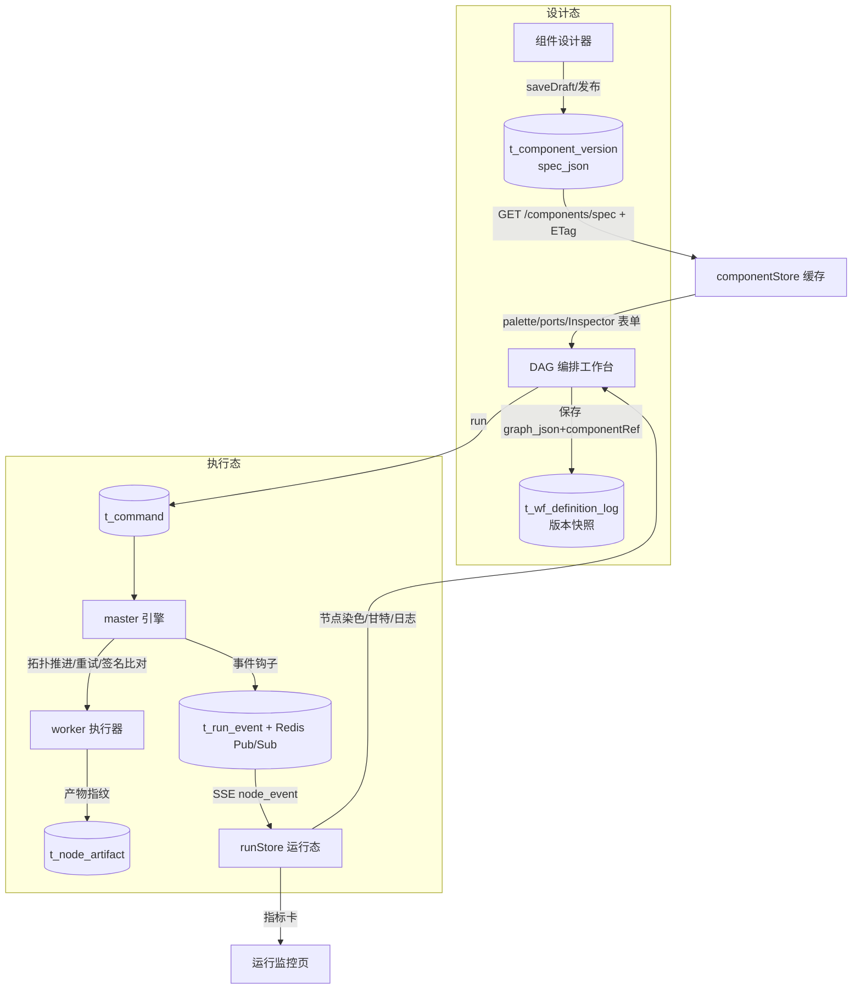

# 组件设计器与 DAG 工作流编排工作台系统性优化方案

| 项 | 内容 |
|---|---|
| 日期 | 2026-10-05 |
| 状态 | 待评审 |
| 范围 | 组件设计工作台、DAG 编排工作台、组件↔工作流协同、执行管线协同 |
| 参考 | D:\ComfyUI-master（声明式节点系统/类型交集匹配/节点级缓存/事件协议） |
| 关联 | docs/DAG组件化编排规范与Datara适配方案.md、docs/组件管理与发布治理设计.md、docs/组件基线化与逐组件发版设计.md |

---

## 1. 执行摘要

### 1.1 目标与战略意义

组件设计器与 DAG 工作流编排是 Datara 数据治理平台的「生产中枢」：组件是可复用的治理能力单元，工作流是治理业务的编排载体，执行管线是治理价值的最终交付通道。三者交互流畅度与衔接质量直接决定平台的数据治理产能。

本方案借鉴 ComfyUI 在 AI 工作编排领域的成熟架构（声明式节点元数据、单一规格下发接口、类型化连线、节点级缓存增量执行、事件驱动执行染色），在**不推翻现有技术栈**（Vue3 + @vue-flow + Pinia / FastAPI + SQLAlchemy）的前提下，对四个方向做渐进式升级，全部新增字段向后兼容、全部存量功能不回归。

### 1.2 现状诊断结论

**已有基础**（不重复建设）：
- 组件治理链完整：草稿 → 冻结 → 发布（八项闸门）→ 离线 → 回滚 → 审计（t_component / t_component_version / t_component_log），draftRev 乐观锁、发布即刷新引用（`_refresh_refs` 扫描 graph_json 注入 componentRef.version）
- 图内核：GraphDocument 单一数据契约 + ViewProfile 多视角 + graphService 深拷贝/版本快照落库/回滚；内置 topoSort/detectCycle
- undo/redo 双端都有（JSON 快照栈 cap 50，拖拽 800ms 合并窗口）；快捷键 Ctrl+Z/Y/C/V/Del/F/Esc；框选多删
- 执行链：master 引擎事件驱动拓扑推进 + Redis Stream 三级优先队列（任务级并行已有）+ 任务级定时重试 + failover 容错恢复 + 失败重跑；SSE 实例级状态推送（1s diff 轮询源）+ t_task_log 日志轮询

**核心差距**：

| 方向 | 差距 | 关键位置 |
|---|---|---|
| ① 组件标准化 | 8 要素中「输出结果定义、交互行为、扩展接口」缺失；目录双源漂移（前端 profile 源码 vs export_dag_catalog.json 静态导出） | componentSpec.ts、componentApi.ts、scripts/export_dag_catalog.py、graph/profiles/*.ts |
| ② DAG 核心能力 | 连线无端口类型匹配（SpecPort.type 全程无消费）；无对齐/分布/多选复制粘贴；校验错误无定位导航；undo 全量 stringify 大图有开销；渲染无视口裁剪/惰性求值 | GraphWorkbench.vue onConnect、graph/model/index.ts、DataNode.vue、layout/dagre.ts |
| ③ 协同 | 组件升级为手动 refresh；无批量升级向导；交互联动散落 profile 硬编码 | componentApi.ts、wf_definition.py、fieldsModel.ts |
| ④ 管线协同 | 无节点级断点续传；重试为固定次数/间隔无分类策略；无工作流模板库；进度推送为实例级 SSE 轮询源；日志 2s 轮询 | master/engine.py、api/instance.py、graphApi.ts |

### 1.3 ComfyUI 借鉴矩阵

| ComfyUI 机制 | 源码实证 | Datara 适配 |
|---|---|---|
| 类属性声明 8 要素 + INPUT_TYPES 三层（required/optional/hidden）+ options 驱动控件 | node_typing.py:96-179、nodes.py:2065 | ComponentSpecV2 声明式 schema（§2.2），fields 升级为三层结构 |
| 单一 object_info 接口下发节点库，前端零硬编码 | server.py:751-819 | GET /api/v1/components/spec 统一下发（§2.3），目录双源归一 |
| 类型即字符串 + 集合交集匹配（`*` 恒匹配） | comfy_execution/validation.py:4-58 | DataType 体系 + 前后端同一交集规则（§3.1） |
| 祖先签名缓存键，只重跑变化部分 | comfy_execution/caching.py:82-148 | 节点签名 = class_type + spec_version + 排序参数 + 上游签名，产物级 checkpoint（§5.2） |
| 事件协议 executing/executed/cached 染色（黄/绿/灰） | server.py:496-824 | SSE 事件扩展 + 画布运行态染色（§5.1） |
| 编辑图 ↔ 执行图双格式分离 | graph_utils.py:106-113 | GraphDocument 保留，run 编译为执行图（现有架构已隐含，显性化） |
| hidden 输入运行时上下文注入（PROMPT/UNIQUE_ID） | node_typing.py:182-194 | 扩展接口 hiddenInputs：向算子注入租户/任务 id/运行上下文（§2.2） |
| 子图/模板复用（blueprints + subgraphs/*.json） | app/subgraph_manager.py:39-95 | 工作流模板库（§5.5），P2 演进子图资产 |

### 1.4 总体技术路线

采用**方案 A：声明式元数据驱动（渐进增强）**，否决「图内核重构」（与对齐海豚、vue-tsc 全绿、零回归硬约束冲突）与「最小补丁」（加剧双源漂移）。原则：

1. **声明优先**：组件 8 要素全部落为可序列化 JSON Schema，后端单一规格接口下发，前端按 spec 渲染，消灭硬编码；
2. **前后端同规则**：连线类型交集、循环检测、闸门校验在前端与后端是同一份纯函数逻辑（各自实现同一规则表，共享测试用例）；
3. **事件驱动执行可视化**：SSE 从实例级扩展到节点级事件流，画布直接消费；
4. **渐进可回退**：所有新字段 optional，spec 服务不可用时降级回现有 profile 渲染。

---

## 2. 方向一：组件设计工作台重构

### 2.1 8 要素标准体系与裁剪规划

8 项要素全部保留，重组为 **4 组**，每组内含 required 与 optional 子项，组件按类型裁剪：

| 组 | 要素 | 必填性 | 说明 |
|---|---|---|---|
| 身份组 | 1 组件唯一标识 | required | type（全局唯一，注册后不可改）+ display_name + aliases（搜索别名，借鉴 SEARCH_ALIASES） |
| | 2 功能描述 | required | summary（一句话）+ description（详细）+ category（分类树路径）+ docUrl |
| 契约组 | 3 输入参数规范 | required | fields 三层：required / optional / hidden；每项含 key/label/uiType/options/校验规则（§2.2） |
| | 4 输出结果定义 | optional（有下游产出的组件必填） | outputs: {name, type, desc}[]，type ∈ DataType（§3.1）；逻辑组件（start/end/conditions 等）可省略 |
| 表现组 | 6 视觉呈现规范 | required | icon/color/shape/badge 规则 |
| | 7 交互行为设计 | optional | behaviors 声明式序列化：showIf/onChange/pick/refreshOn/prefillFromUpstream（现状散落 profile 硬编码迁入） |
| 扩展组 | 5 配置选项 | optional | dropPolicy（snapToGrid/autoName/prefillFromUpstream/autoConnect/maxInstances）+ initTemplate |
| | 8 扩展接口定义 | optional | extensions.hiddenInputs（运行时上下文注入：tenantId/runId/nodeId）、extensions.capabilities（testable/preview 上限 100 条）、extensions.widgetPlugins |

**裁剪规则**：拖入组件至少需身份组 + 契约组 required 层 + 视觉呈现即可落库；契约组 optional 层、交互行为、扩展接口按组件能力勾选。设计器表单按 4 组分页签展示，缺失项显式标「未定义」而非隐藏，保证 8 要素可审计。

### 2.2 ComponentSpecV2 元数据结构

```ts
// services/componentSpec.ts 升级（全部新增字段 optional，向后兼容）
interface ComponentSpecV2 {
  // ── 身份组
  type: string                    // 唯一标识（现有）
  displayName: string
  aliases?: string[]              // 搜索别名
  // ── 身份组·描述
  summary: string
  description?: string            // 详细描述（支持 markdown）
  category: string                // 分类树路径，如 "批处理与同步/数据源"
  docUrl?: string
  // ── 契约组·输入（三层，借鉴 INPUT_TYPES）
  fields: FieldSpec[]             // 现有结构增强
  interface FieldSpec {
    key: string; label: string
    layer: 'required' | 'optional' | 'hidden'   // 默认 required
    uiType: 'input'|'number'|'select'|'switch'|'textarea'|'date'|'table'|'endpoint_select'|'code'
    options?: { min?: number; max?: number; step?: number; placeholder?: string;
                multiline?: boolean; choices?: {label:string;value:string}[]; remote?: string }
    required?: boolean; default?: unknown
    desc?: string
    showIf?: string               // 声明式联动：表达式（§交互行为）
  }
  // ── 契约组·输出（新增，缺失即全案 8 要素缺口①）
  outputs?: { name: string; type: DataType; desc?: string }[]
  // ── 表现组
  icon: string; color?: string
  shape?: 'default'|'device'|'branch'
  badge?: { key: string; colorMap: Record<string,string> }   // 现有 dagRelevant 等角标规则化
  // ── 表现组·交互行为（新增，缺口②，现状从 profile 硬编码迁移）
  behaviors?: {
    onChange?: { field: string; action: 'refreshOptions'|'resetFields'|'prefill'; target?: string[]; remote?: string }[]
    prefillFromUpstream?: { field: string; from: 'input.table'|'input.columns'|'input.datasource' }[]
    pick?: { field: string; picker: 'table'|'column'|'cron'|'sshHost' }[]
  }
  // ── 扩展组
  dropPolicy?: { snapToGrid?: boolean; autoName?: boolean; prefillFromUpstream?: boolean
                 autoConnect?: boolean; maxInstances?: number }
  initTemplate?: Record<string, unknown>
  // ── 扩展组·接口（新增，缺口③）
  extensions?: {
    hiddenInputs?: ('tenantId'|'runId'|'nodeId'|'workflowId')[]   // 运行时上下文注入
    capabilities?: { testable?: boolean; previewLimit?: number }  // previewLimit ≤100 对齐组件设计器约束
  }
  // ── 版本与治理（对接现有治理链）
  specVersion?: string            // 语义化 "major.minor"
  ports?: { inputs: PortSpec[]; outputs: PortSpec[] }   // 画布端口（outputs 升级为带 type）
}
type DataType = 'any'|'string'|'number'|'boolean'|'json'|'table'|'dataset'|'file'|'stream'|'none'
```

### 2.3 组件规格统一服务（目录双源归一）

**目标**：消灭「前端 profile 源码 + export_dag_catalog.json 静态导出」双源，后端成为组件规格唯一真源，前端零硬编码（ComfyUI object_info 模式）。

- 后端：`t_component_version.spec_json` 冻结即含 ComponentSpecV2；新增 **GET /api/v1/components/spec**（§6.1）聚合全量已发布组件规格，ETag 缓存；种子/内置组件以后端 seed 表兜底注册。
- 前端：`componentStore` 启动拉取 spec 并缓存（ETag 304）；`graph/profiles/*.ts` 改造为「spec 驱动渲染 + profile 兜底」——palette 分类树、NodeSchema.ports、Inspector 表单全部读 spec；spec 缺失或服务不可用时回退现 profile（渐进切换，可灰度）。
- 一致性校验：现有 `ComponentStats.consistencyErrors/unroutedTypes` 机制保留，作为切换期「profile vs spec」对账工具；切换完成后 export_dag_catalog.py 退役。

### 2.4 版本管理与冲突解决机制

- 复用现有治理链（草稿 draftRev 乐观锁 / 冻结快照 / 发布闸门 / 回滚 / 审计），不另起炉灶。
- **specVersion 语义化**：新增字段、可选层、desc 修改 = minor；删除字段、改 uiType/type、删输出、required 收紧 = **major（破坏性）**。
- **破坏性变更流程**：发布闸门新增检查 → 触发 impacted 分析（已有接口）→ 强制弹出「影响工作流清单」→ 发布者必须提供 fieldMapping（旧字段→新字段映射）或确认「不迁移」方可发布。
- **冲突解决**：
  - 编辑冲突：draftRev 409（已有）→ 前端拉取远端 diff 视图，三方展示（我的/远端/基准），逐项选择；
  - 发布冲突：spec 与在用工作流引用版本不一致 → 走 §4.3 升级策略；
  - 所有冲突决策写 t_component_log 审计。

### 2.5 组件开发规范文档

实施期产出 `docs/组件开发规范.md`（作为 P0 交付物之一），要点：8 要素填写标准与反例、DataType 选用表、FieldSpec 控件选型表、behaviors 表达式语法、组件命名与分类树约定、测试验证要求（capabilities.testable + ≤100 条预览）、发布闸门自查清单。

### 2.6 组件库管理系统

- ComponentHubView 三页签（目录/基线化/设计器，v-show 保活）保留；目录页新增「规格视图」：按 4 组展示 8 要素完整度徽标（8/8 全绿、缺项黄色）。
- 组件搜索支持 aliases + category 树过滤。
- 设计器（fields/page 双模式）表单升级为 4 组页签结构（§2.1），每要素含校验与帮助文案；8 项要素缺失项在设计器内一键补全引导。

### 2.7 交互原型（组件设计器页面增强）

```
┌──────────────────────────────────────────────────────────────────┐
│ [顶置操作条] 保存 | 冻结 | 发布 | 刷新 | 影响分析 | 规格完整度 8/8 │
├──────────┬──────────────────────────────────┬────────────────────┤
│ 组件选择  │  8 要素编辑表单（4 组页签）        │  实时预览          │
│ (分类树)  │  ┌ 身份 | 契约 | 表现 | 扩展 ┐    │  · 画布节点形态    │
│  搜索     │  │ 唯一标识  [________]      │    │  · Inspector 表单  │
│  └─批处理 │  │ 功能描述  [________]      │    │  · 输出端口类型    │
│  └─流处理 │  │ 输入参数  三层分组编辑器    │    │  · 测试预览 ≤100 条│
│  完整度   │  │ 输出定义  [+端口 type]    │    └────────────────────┤
│  徽标     │  │ 交互行为  声明式规则编辑    │    │ 影响分析浮窗        │
└──────────┴──────────────────────────────────┴────────────────────┘
```

---

## 3. 方向二：DAG 工作流核心能力增强

### 3.1 类型化连线系统（精准类型匹配校验）

**DataType 与端口类型**：组件 outputs 与 ports 声明 DataType（§2.2）；旧组件未声明视为 `any`（向后兼容，全存量组件默认可连，不回归）。

**匹配规则**（前后端同一份规则，ComfyUI 集合交集模式）：

```ts
// graph/model/portTypes.ts —— 纯函数，前后端共用同一规则表
export function portTypesMatch(src: DataType, dst: DataType): boolean {
  if (src === 'any' || dst === 'any') return true
  if (src === 'none' || dst === 'none') return false
  return TYPE_COMPAT[src].includes(dst)   // 兼容矩阵而非纯相等：
}   // dataset→table ✅（数据集可接表）、stream→dataset ❌、json→string ✅ 等
```

**校验时机（交互流程）**：



**实施要点**：`SpecPort.type` 首次接入消费链路；vue-flow `isValidConnection` 做拖线实时反馈；保存闸门与后端 `graph_rules.py` 复用同一兼容矩阵（共享测试用例表固化行为）。

### 3.2 数据流向可视化

- **边流向动画**：运行态中两个「执行中节点」之间的边播放流动动画（CSS `stroke-dashoffset` 关键帧，SSE 事件驱动启停）；
- **边类型着色**：连线落成即按源端口 DataType 着色（table=蓝、dataset=青、stream=紫、file=橙、any=灰），图例浮窗随工具条可开；
- **边数据浮窗**：点击边显示「上游输出 schema（outputs 定义）+ 最近一次运行样例数据（≤100 行，复用组件设计器预览上限约束）」；无运行记录时仅显示 schema 与类型说明；
- **Reroute 转接节点**（借鉴 ComfyUI 纯前端节点）：长直边可插入转接点美化布线，仅存于 GraphDocument（编辑图），执行编译时展开消除（双格式分离）。

### 3.3 异常状态实时反馈与定位

- **节点级错误标注**：校验失败节点红描边 + 感叹角标；悬停显示首条错误摘要；
- **错误聚合面板**：画布底部可收起抽屉，列出全部校验错误（节点错误/边错误/闸门错误三类分页签），每条含「定位」按钮 → `fitView` 聚焦该节点并高亮 2s（点击 ≤2 次定位任意错误）；
- **Inspector 错误页签**：选中错误节点时 Inspector 顶部显示错误卡片，点击跳转对应表单项；
- **运行态错误定位**：SSE `node_error` 事件 → 节点红染 + 角标 + 点击直达日志侧窗对应行（复用 LogPanel）。

### 3.4 依赖关系管理与循环检测增强

- 单图环检测：现有 `detectCycle` 保持（onConnect + 保存闸门双时机）；
- **跨图依赖环检测**（新增）：dependent 组件选择外部工作流节点后，构建「工作流引用图」（wf → 依赖 wf），保存时 DFS 检测引用环，含环时给出环路径展示；
- 依赖三粒度（结果表 → 字段子集 → 行过滤表达式）与同周期/同批次条件保持现有 EdgePartialDep 设计，仅在错误聚合面板中补充「依赖配置不完整」检查项。

### 3.5 画布操作流畅度

**批量操作（新增）**：

| 操作 | 交互 | 说明 |
|---|---|---|
| 对齐 | 多选后工具条/右键：左/右/顶/底/水平居中/垂直居中 | 以选集边界为基准 |
| 等距分布 | 水平分布/垂直分布 | 选集 ≥3 有效 |
| 多选复制粘贴 | Ctrl+C / Ctrl+V | 粘贴偏移 +24px，新节点 ID 按 max-existing-sequence+1 重生成（硬约束），内部边随行复制，跨组件连线不复制 |
| 批量改属性 | 多选态 Inspector 显示公共属性，修改批量应用 | 仅写交集字段 |
| 快速复制 | Ctrl+D 原位复制选中节点 | |

**undo/redo 优化（渐进）**：
- P0：`JSON.stringify` 换 `structuredClone`（快 ~3-5 倍）+ 保留现有 800ms 拖拽合并 + 快照栈上限 50 不变；
- P1：**命令栈模式**——AddNode/DeleteNode/MoveNodes/Connect/Disconnect/UpdateProps 六类命令各自实现 apply/undo，快照栈作为命令栈兜底开关（灰度可回退），大图（>150 节点）自动切命令栈。

**快捷键矩阵（在现有基础上新增）**：

| 键 | 现状 | 新增 |
|---|---|---|
| Ctrl+Z/Y、Ctrl+C/V、Del、Ctrl+F、Esc | 已有 | — |
| Ctrl+A | — | 全选画布节点 |
| Ctrl+D | — | 原位复制选中 |
| 方向键 | — | 选中节点微移（1px，Shift=网格步长） |
| F2 | — | 重命名选中节点 |
| ? | — | 快捷键帮助面板浮窗 |
| Ctrl+对齐类 | — | 对齐/分布快捷键（同上表） |

### 3.6 图形渲染引擎优化

| 手段 | 说明 | 预期 |
|---|---|---|
| 视口裁剪 | vue-flow 内置 `onlyRenderVisibleElements` 开启 | 200 节点场景 DOM 数量降一个数量级 |
| ports() 惰性求值 | DataNode 内 ports 结果按 `schemaId+data 摘要` memo 化，杜绝每帧重算 | 拖拽帧预算达标关键项 |
| syncFromDoc 增量化 | P0 保守全量（现状）；P1 按变更集合 diff（nodes/edges 增删改三类 patch） | 热路径开销下降 |
| dagre 布局 Worker | 节点 >200 时布局计算移入 Web Worker，主线程显示进度 | 布局不再卡 UI |
| 静态化背景 | 网格/背景图层与节点层分离，拖动时仅 transform 平移 | 平移流畅 |

**性能基准（验收依据）**：建立 `tests/perf/canvas-bench.ts` 脚本（200 节点/400 边标准图），指标：拖拽 ≥30 FPS、缩放/平移 ≥45 FPS、布局耗时 P95 <1.5s、内存无持续增长（10 分钟拖拽回归）。

### 3.7 画布状态管理

- 每文档持久化：视口 `{x,y,zoom}`、激活 Tab、选中集（仅存 id 列表）、浮窗开合状态 → `localStorage` 键 `canvas-state:{docId}`，切换/重开恢复；
- 多 Tab（dagTabs 上限 5）切换由 `:key` 重挂载改为 **keep-alive + activated 恢复视口**，消除切换闪白与重复初始化。

---

## 4. 方向三：有机一体的协同工作流

### 4.1 统一操作范式与视觉语言（设计系统规范）

| 规范项 | 统一标准 |
|---|---|
| 操作按钮位置 | 一律顶置操作条（工作台顶部，避免底部滚动）——沿用现有偏好约束 |
| 浮窗体系 | 复用 FloatDef/propsOf 机制（已有），新增浮窗（边数据、图例、错误面板、影响分析）统一走 FloatDef 注册，位置/开合持久化 |
| 颜色语义 | 成功绿 / 执行中琥珀 #d97706 / 错误红 / 禁用灰虚线 / cached 灰 ——与质量覆盖图既有语义一致，运行态染色沿用同一套 |
| 角标语义 | 组件引用角标、版本变更角标（specVersion 高于引用版本时黄色）、错误角标三样式固定 |
| 表单渲染 | 拖入弹窗与右侧 Inspector 共用同一渲染组件（已有约束），ComponentSpecV2.fields 为唯一表单源 |

### 4.2 双工作台无缝切换与状态保持

- ComponentHubView 已 v-show 保活；扩展到「组件设计器 ↔ DAG 编排」互跳链路：设计器「引用关系」页签点击某工作流 → 路由跳转 `#/dag/design?doc=xx&focus=nodeId` → 画布聚焦该节点；DAG 画布点击组件引用角标 → 跳转设计器并载入该组件草稿/对应版本；
- 跳转经路由 query 传递意图（focus/highlight），**目标工作台恢复自身持久化状态**（视口/Tab/选中，§3.7）而非重置；
- 返回路径用路由 history，不做额外面包屑（避免重复导航范式）。

### 4.3 组件定义更新实时同步至工作流（发布即同步升级）

现状「发布即刷新引用」（后端扫 graph_json 注入新 version）升级为**三档升级策略 + 批量升级向导**：



- 发布弹窗新增「升级策略」选择（默认 patch 自动 / major 必须走向导或锁定）；
- 批量升级向导：多选工作流 → 逐个 diff → 映射确认 → 逐个保存（base_version 乐观锁，冲突项跳过进失败清单）→ 结果报告；
- 工作流侧引用角标实时反映「有新版本可用」（spec ETag 变更 → componentStore 广播 → 画布角标刷新）。

### 4.4 数据共享与一致性保障

- **单一规格源**：spec 接口 ETag（§2.3）保证多工作台读同源；componentStore 失效时机 = 发布/回滚/离线事件（EventBus 广播）；
- **版本钉住**：GraphDocument 内 componentRef 记录 `version`（已有）+ 新增 `pinned: boolean`，钉住即不自动升级；
- **乐观锁全覆盖**：组件 draftRev（已有）、工作流 base_version（已有）、批量升级逐个校验（新增）——三层保证无静默覆盖；
- 一致性对账：切换期 ComponentStats.consistencyErrors 定期报告 profile 与 spec 差异，归零后完成切换。

### 4.5 状态持久化与恢复

| 状态 | 持久化位置 | 时机 |
|---|---|---|
| 组件草稿编辑内容 | 后端 saveDraft（已有） | 30s 防抖自动保存 + beforeunload 强制保存 |
| 画布视口/选中/浮窗 | localStorage（§3.7） | 变更防抖 500ms |
| 工作台 Tab 开合 | dagTabs 持久化到 localStorage | 变更即存 |
| undo 栈 | 不跨会话（明确不做，YAGNI） | — |

---

## 5. 方向四：管线协同能力提升

### 5.1 执行监控可视化（节点级事件染色）

**SSE 事件协议扩展**（向后兼容，现有实例级事件保留；借鉴 ComfyUI 事件族）：

```
GET /api/v1/instances/{id}/stream           （现有，保留）
event: node_event
data: {"runId":"...","nodeId":"sql_3","type":"node_executing","ts":...}
  type ∈ node_executing(黄) | node_executed(绿) | node_cached(灰)
      | node_error(红,含 exceptionType/message) | node_retry(琥珀,含 attempt/max)
      | progress(含 payload: {value,max}) | execution_start | execution_success | execution_interrupted
```

- 推送源升级：master 引擎事件钩子 → Redis Pub/Sub → api SSE 直接订阅（替换现「服务端 1s diff 轮询」，事件延迟 <1s）；
- 画布消费：运行监控视角打开时订阅，节点染色（黄/绿/红/灰四态，与 §3.3/§4.1 语义一致）+ 运行中边流动动画（§3.2）；

**节点执行状态转换图**（与现有 master/state.py 任务 9 态映射，画布只消费可视化 4 态）：


- 运行监控页新增：**节点甘特时间线**（排队/运行/成功/失败分段时长）、指标卡（总时长、并行峰值、重试次数、吞吐行数）、失败节点「定位到画布」按钮；
- 日志：LogPanel 轮询升级为同一 SSE 流驱动的增量追加（保留 3s 轮询降级通道）。

### 5.2 断点续传（产物级 checkpoint）

借鉴 ComfyUI「祖先签名缓存」的保守适配：

- **节点产物登记**：任务执行器成功后写 `t_node_artifact(run_id, node_id, node_signature, artifact_fingerprint, refs)`；任务级产物如同步任务目标表、SQL 临时表、文件产物路径；
- **节点签名**：`node_signature = hash(class_type, spec_version, 排序后参数, 上游签名)`（递归纳入上游，任一上游变化即失效）；
- **断点续跑**：`rerun-failed` 升级——引擎重跑前逐节点比对签名与产物指纹：**命中则跳过执行、标记 cached 灰色**；不命中（宁多勿漏）则正常执行；
- 触发入口：运行监控「从失败节点续跑」（复用现有失败重跑实例，新实例携带 checkpoint 上下文）；
- 产物清理：对齐「定期清理远期日志脚本」约束，同一清理任务按 run 保留期清理 t_node_artifact。

### 5.3 错误智能重试

现有固定 retryTimes/retryInterval 保留为默认，新增**分类策略**（engine `_schedule_retry` 扩展）：

| 错误分类（按 exceptionType/SQLSTATE/退出码归类） | 策略 |
|---|---|
| 瞬时类（连接超时/死锁/临时不可用） | 自动指数退避 1s→5s→25s，上限 3 次 |
| 拥塞类（资源不足/队列满） | 延长退避（30s 起）+ 提示降低并行度 |
| 确定性类（语法错误/权限/数据质量） | 不自动重试，转失败并定位（§3.3 运行态定位） |
| 外部类（SSH 断连/HTTP 5xx） | 按组件 retryTimes 兜底，默认 2 次 |

分类器实现为独立纯函数模块（错误字符串/异常类型 → 分类），规则表可配置；SSE `node_retry` 事件让用户实时看到「第 n/3 次重试（指数退避）」。

### 5.4 任务并行执行增强

并行基础设施已有（三级优先队列 + 并发 worker + 拓扑推进）。补齐：

- 工作流级 `parallelism` 配置（Inspector 工作流属性页，默认不限）；
- 运行监控「关键路径」高亮：按节点耗时计算最长路径，琥珀描边展示瓶颈。

### 5.5 工作流模板管理与版本控制

- 新表 `t_wf_template(id, name, category, description, template_json, version, created_by, updated_at)`：template_json 即 GraphDocument 快照；
- API：CRUD + `POST /{id}/instantiate`（复制为新工作流草稿，ID/变量全量重生成）+ `GET /{id}/versions`（模板每次修改追加版本记录）；
- 入口：任务编排列表「另存为模板」/ 模板中心页签「从模板新建」；
- 模板升级：模板 v2 发布后，基于旧版实例化的工作流列表提供「可选升级」提示（diff 预览 + 确认，不做静默覆盖）。

### 5.6 监控数据模型与实时采集推送

| 表 | 用途 | 要点 |
|---|---|---|
| t_run_event（新增，追加型） | 节点级事件持久化（SSE 推送同时落库） | run_id/node_id/event_type/payload_json/ts；保留期清理任务与日志同策略 |
| t_node_artifact（新增） | 断点续传产物指纹 | node_signature + fingerprint，命中即 cached |
| t_wf_template（新增） | 模板库 | §5.5 |

---

## 6. 后台接口设计规范

### 6.1 新增 API 清单

| # | 接口 | 方法 | 数据结构（关键） | 说明 |
|---|---|---|---|---|
| 1 | /api/v1/components/spec | GET | `ComponentSpecV2[]`（§2.2） | 全量已发布组件规格；响应头 ETag，支持 If-None-Match 304 |
| 2 | /api/v1/components/{type}/publish 扩展 | POST | 请求体新增 `upgradeStrategy: 'auto'\|'manual'\|'pin'`、`fieldMapping?` | 发布闸门新增破坏性变更检查 |
| 3 | /api/v1/components/{type}/upgrade-refs | POST | `{targets:[{wfId,strategy}], fieldMapping?}` → `{results:[{wfId,ok,reason,newVersion}]}` | 批量升级向导后端 |
| 4 | /api/v1/instances/{id}/stream 扩展 | GET(SSE) | `node_event` 事件族（§5.1） | Redis Pub/Sub 源，实例级事件保留 |
| 5 | /api/v1/workflow-definitions/{wf}/runs/{runId}/resume-from | POST | `{fromNodeIds:string[]}` | 断点续跑（异步，返回新 runId） |
| 6 | /api/v1/workflow-templates | GET/POST/PUT/DELETE | t_wf_template | 模板 CRUD + 分页/分类筛选 |
| 7 | /api/v1/workflow-templates/{id}/instantiate | POST | `{name?}` → 新工作流 id | 实例化 |
| 8 | /api/v1/workflow-templates/{id}/versions | GET | 版本列表 | 模板版本链 |
| 9 | /api/v1/instances/{id}/events | GET | t_run_event 分页查询 | 事件回放（补查错过的 SSE） |

### 6.2 接口性能要求

| 接口 | 指标 |
|---|---|
| components/spec | P95 < 100ms（命中 ETag 时 <20ms），gzip，全量 ≤500KB |
| SSE node_event | 事件端到端延迟 P95 < 1s；断线重连 <3s 自动恢复并补发缺失事件（last-event-id 对账 events 接口） |
| upgrade-refs | 单工作流处理 <500ms，50 工作流批量 P95 < 30s（异步进度可查） |
| resume-from | 响应 <200ms（异步执行），签名比对单节点 <10ms |
| 模板 CRUD | P95 < 200ms；instantiate < 1s |
| 画布运行态渲染 | node_event 到 DOM 染色 < 200ms |

---

## 7. 数据流转机制

### 7.1 总体数据流图



### 7.2 状态管理方案（Pinia store 职责）

| Store | 职责 | 关键状态 |
|---|---|---|
| graphStore（已有） | 文档/undo/dirty | doc、undo 栈、dirty 标 |
| componentStore（新增） | 组件规格缓存与失效 | specMap、ETag、加载态；发布/回滚/离线事件触发失效 |
| runStore（新增） | 运行态 | runId、nodeStateMap（executing/executed/cached/error）、SSE 订阅生命周期、指标 |
| templateStore（新增） | 模板 | 列表/分类/版本 |
| dagTabs（已有） | 多 Tab | 扩展持久化（§3.7） |

**事件流**：EventBus（已有，emit 全部 try/catch 隔离）承载跨 store 广播；SSE 事件统一入 runStore，再分发染色/甘特/日志三消费者，禁止组件各自开连接。

### 7.3 数据一致性保障措施

1. **乐观锁三层**：组件 draftRev、工作流 base_version、批量升级逐工作流校验（§4.4）；
2. **快照可回溯**：工作流版本快照落库（已有）、组件版本快照（已有）、模板版本链（新增）；
3. **发布一致性**：发布闸门（不可绕过）+ 破坏性变更强制影响分析 + fieldMapping 迁移（§2.4）；
4. **事件不丢**：SSE last-event-id + t_run_event 回放补发（§6.1 #9）；
5. **缓存失效闭环**：spec ETag + EventBus 失效广播 + 画布角标实时刷新（§4.3）。

---

## 8. 用户体验提升策略

### 8.1 操作流程优化（高频路径前后对比）

| 高频路径 | 现状 | 优化后 |
|---|---|---|
| 组件发布后同步工作流 | 发布 → 手动逐个工作流找到引用 → 手动改版本（5+ 步） | 发布弹窗选策略 → 自动/向导一次完成（2 步） |
| 定位校验错误 | 校验按钮 → 读错误文本 → 手动画布找节点（3+ 步） | 错误面板点「定位」自动聚焦（1 步） |
| 从失败恢复执行 | 失败重跑 = 全图重跑 | 断点续跑：命中产物自动跳过，仅重跑失败及其下游 |
| 多节点整理 | 逐个拖动对齐 | 框选 → 对齐/分布一键 |
| 新建相似工作流 | 从零搭建 | 从模板新建（1 步） |

### 8.2 反馈机制设计

| 场景 | 反馈形式 |
|---|---|
| 连线被拒 | toast 显示原因（类型不匹配：源 table → 目标 stream）+ 两端端口红闪 1s |
| 拖线中 | 可连端口正常、不可连端口半透明（实时预判，不打断） |
| 保存冲突 | 顶部警示条「远端已更新」+ diff 查看按钮，不做静默覆盖 |
| 发布影响 | 发布前影响清单预览（强制确认破坏性变更） |
| 运行反馈 | 节点四态染色 + 边流动 + 重试进度角标（第 n/3 次）+ 失败一键看日志 |
| 自动保存 | 30s 防抖保存，右上角轻提示「已自动保存」，冲突时才打断 |

### 8.3 用户引导方案

- 快捷键帮助面板（`?` 呼出，含全部新增快捷键）；
- 组件库分类树首次进入自动展开当前分类，搜索支持别名（§2.1 aliases）；
- 组件悬停卡片：displayName + summary + 输入输出类型摘要（读 spec）；
- 8 要素完整度徽标（目录页 + 设计器顶条），缺失项点击直达对应编辑组；
- 升级向导/断点续跑等新能力首次出现时气泡说明（可关闭不再提示）。

---

## 9. 实施优先级、资源评估、风险与衡量指标

### 9.1 优先级矩阵（按方向 1→2→3→4 顺序展开）

| 批次 | 项 | 内容 |
|---|---|---|
| **P0-1（方向一）** | 1a | ComponentSpecV2 schema + GET /components/spec + 目录双源归一（spec 真源，profile 兜底降级） |
| | 1b | 设计器 8 要素 4 组页签表单 + 完整度徽标 + 输出定义编辑 |
| | 1c | 破坏性变更闸门 + fieldMapping 数据结构（向导 UI 在 P1） |
| **P0-2（方向二）** | 2a | portTypes.ts 交集规则 + isValidConnection 实时校验 + 保存闸门/后端 graph_rules 同规则 |
| | 2b | 错误聚合面板 + 一键定位 + Inspector 错误卡片 |
| | 2c | 批量操作：对齐/分布/多选复制粘贴/Ctrl+A/D |
| | 2d | undo structuredClone 优化 + onlyRenderVisibleElements + ports memo + 性能基准脚本 |
| **P0-3（方向三）** | 3a | 画布状态持久化（视口/Tab/选中）+ Tab keep-alive |
| | 3b | 升级策略三档（发布弹窗）+ 引用角标实时刷新 |
| **P0-4（方向四）** | 4a | SSE node_event 协议 + Redis Pub/Sub 源 + 画布四态染色 + 日志 SSE 化 |
| **P1** | 1d | 交互行为 behaviors 序列化 + hiddenInputs 扩展接口 + 组件开发规范文档 |
| | 2e | undo 命令栈（灰度开关）+ syncFromDoc 增量化 + dagre Worker |
| | 2f | 边类型着色 + 边数据浮窗 + Reroute 转接节点 |
| | 3c | 批量升级向导（diff + fieldMapping UI） |
| | 3d | 草稿 30s 自动保存 + 冲突 diff 视图 |
| | 4b | 断点续传（t_node_artifact + resume-from + cached 染色） |
| | 4c | 智能重试分类策略 |
| | 4d | 工作流模板库（表 + CRUD + instantiate + 模板中心页签） |
| **P2** | 2g | 跨工作流依赖环检测 |
| | 4e | 全图签名缓存（ComfyUI 完整形态，任意节点重跑） |
| | 4f | 关键路径高亮 + 并行度配置 |
| | 3e | 子图/流程片段复用（blueprints 模式） |

### 9.2 资源评估

| 批次 | 后端（人周） | 前端（人周） | 技术栈 |
|---|---|---|---|
| P0-1 | 2（spec 服务/闸门/归一） | 3（V2 表单/徽标/降级渲染） | 现有栈，无新增依赖 |
| P0-2 | 1（graph_rules 复检） | 4（连线/错误面板/批量/undo/性能） | 现有栈（vue-flow 内置能力为主） |
| P0-3 | 0.5（upgrade-refs 自动档） | 2（状态持久化/keep-alive/发布弹窗） | 现有栈 |
| P0-4 | 2.5（事件钩子/PubSub/SSE） | 2（runStore/染色/日志） | 现有栈（Redis Pub/Sub 已有连接设施） |
| P1 | 5（断点续传/重试分类/模板/升级向导） | 7（命令栈/增量同步/浮窗/向导/模板中心） | 现有栈（Web Worker 原生） |
| P2 | 3 | 3 | 现有栈 |
| **合计** | **14** | **21** | — |

前置技能要求：Vue3/TypeScript/Pinia（团队已有）、Redis Stream/PubSub（已有基础）、无需引入新框架。

### 9.3 潜在风险与应对

| # | 风险 | 等级 | 应对 |
|---|---|---|---|
| R1 | 目录双源归一切换引发 palette/表单回归 | 高 | spec 缺失逐组件回退 profile 渲染（降级开关）；ComponentStats.consistencyErrors 对账归零后再退役导出脚本；灰度按组件类型分批切换 |
| R2 | SSE 改造影响现有实例级推送 | 高 | 新事件类型 additive，实例级事件格式不动；SSE 源替换为灰度开关（可切回 1s diff 轮询） |
| R3 | 断点续传签名/指纹误判导致脏数据复用 | 高 | 保守策略：签名不匹配一律重跑（宁多勿漏）；产物指纹包含数据版本要素；上线初期仅对「幂等任务类型」启用 |
| R4 | vue-flow 大图性能上限不确定 | 中 | P0-2 先建 200 节点基准，数据说话后再决定 P1/P2 深度优化投入 |
| R5 | undo 命令栈改造回归 | 中 | 命令栈/快照栈双实现 + 灰度开关，大图自动切换，随时可退 |
| R6 | 事件洪水（大图高频 progress） | 中 | progress 节流（200ms 合帧）+ SSE 服务端合流；t_run_event 落库按类型采样 |
| R7 | 模板与工作流演进分裂 | 低 | 模板升级仅提示不强制；版本链可回滚 |

### 9.4 预期效果与衡量指标

| 维度 | 指标 | 基线 | 目标 |
|---|---|---|---|
| 性能 | 200 节点画布拖拽帧率 | 未测（预期 <20FPS） | ≥30 FPS |
| | 连线校验判定耗时 | — | 单次 <1ms（纯函数） |
| | SSE 事件端到端延迟 | 实例级 1s 轮询 | <1s P95 |
| | 组件规格首屏 | 随 bundle 打包 | 接口 P95<100ms / ETag 304<20ms |
| 体验 | 校验错误定位 | 3+ 步 | ≤2 次点击 |
| | 组件发布→工作流同步 | 5+ 步手动 | 2 步（自动/向导） |
| | 失败恢复耗时（MTTR） | 全图重跑时长 T | 仅失败+下游（预期缩短 50%+） |
| | 高频快捷键覆盖率 | 7 个 | 12+ 个 |
| 业务 | 组件应填要素完整率（按 §2.1 裁剪规则判定应填项） | 输出/行为/接口三项普遍缺失 | 100%（目录徽标全绿） |
| | 目录双源一致性错误 | 存在漂移 | 归零 |
| | 重跑节省计算时长 | 0 | cached 节点占比可统计、月度节省时长报表 |
| | 模板复用新建占比 | 0 | 上线 3 个月 ≥30% 新建走模板 |

---

## 10. 分阶段实施计划

| 阶段 | 批次 | 里程碑产出 | 验收点 |
|---|---|---|---|
| 阶段一（P0） | P0-1 | spec 服务 + V2 表单 + 双源归一（降级开关） | 目录徽标全绿；spec 不可用时全功能可回退 |
| | P0-2 | 类型化连线 + 错误定位 + 批量操作 + 性能基准 | 基准达标；前后端校验用例表全绿 |
| | P0-3 | 画布状态持久化 + 升级策略 | 刷新/切换状态恢复；发布三档生效 |
| | P0-4 | SSE 节点事件 + 画布染色 | 运行实例实时染色正确；降级开关可回退 |
| 阶段二（P1） | 4b→4d→2e→3c→1d→2f→3d 顺序 | 断点续传、模板库、命令栈、升级向导、规范文档 | 各自验收标准（§12） |
| 阶段三（P2） | 按需 | 深度性能、跨图检测、子图复用 | 按单项验收 |

每批次交付后执行：vue-tsc 0 错误 + vitest/pytest 全绿 + 1.9 环境 UI 实测（现有流程）+ 本文档对应验收标准核对。

## 11. 质量保障措施

1. **类型与测试基线**：vue-tsc 0 错误、vitest/pytest 全绿为每批次合并门槛（现有硬约束延续）；
2. **校验规则一致性**：portTypes 交集规则与后端 graph_rules 共享同一「测试用例表」（同一组输入期望同一输出，两套实现分别跑同一表）；
3. **性能回归**：canvas-bench 脚本纳入 P0-2 交付，后续每批次画布相关改动跑基准对比；
4. **浏览器回归**：每个新增视图/浮窗在 1.9 环境实测并截图留档（现有流程）；
5. **灰度开关清单**：spec 降级、SSE 源、命令栈、断点续传启用范围——四个开关统一登记，均可运行时回退；
6. **审计闭环**：升级/钉住/续跑等新决策全部落 t_component_log / t_run_event，可追溯。

## 12. 验收标准

**方向一**：① GET /components/spec 返回全量已发布组件且含 8 要素结构；② 设计器可编辑输出定义/交互行为/扩展接口并走通发布闸门；③ 制造一次破坏性变更发布，impacted 清单与 fieldMapping 流程正确拦截；④ 断开 spec 服务后画布/表单以 profile 兜底无白屏。

**方向二**：① 拖线实时拦截类型不匹配且 toast 原因准确；② 保存闸门与后端对同一批非法图全部拒绝（用例表 100% 通过）；③ 错误聚合面板任意错误 ≤2 次点击定位；④ 对齐/分布/多选复制粘贴可用且粘贴 ID 遵守 max+1；⑤ 200 节点基准达标（≥30 FPS / 布局 P95<1.5s）。

**方向三**：① 双工作台互跳后目标侧状态（视口/选中）正确恢复；② patch 发布后引用角标与版本自动刷新；③ major 发布走向导可完成迁移并出结果报告；④ 组件/工作流/批量升级三层乐观锁均能正确拒绝并发写。

**方向四**：① 运行实例画布四态染色与实际执行一致（黄/绿/红/灰）；② 断点续跑命中产物节点显示灰、耗时 0，未命中正常重跑；③ 瞬时错误自动指数退避重试且 node_retry 事件可见；④ 模板创建→实例化→升级提示全链路可走通；⑤ SSE 延迟 P95<1s 且断线重连不丢事件（events 回放补齐）。
